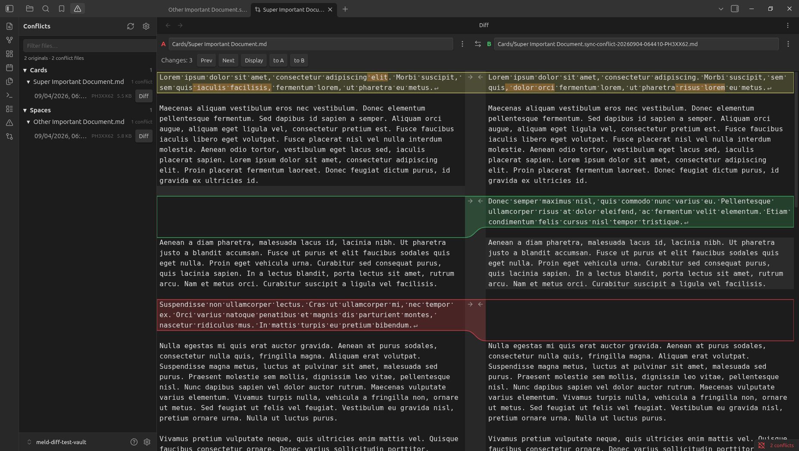
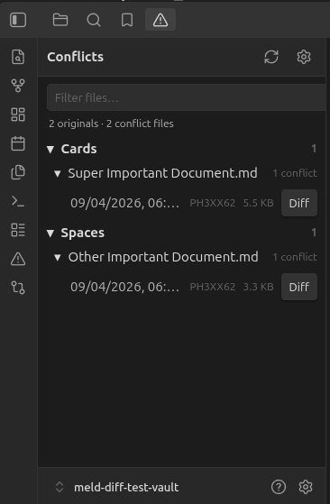
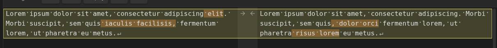
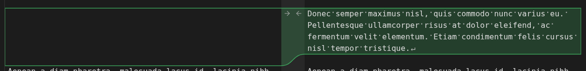
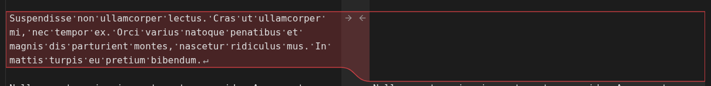
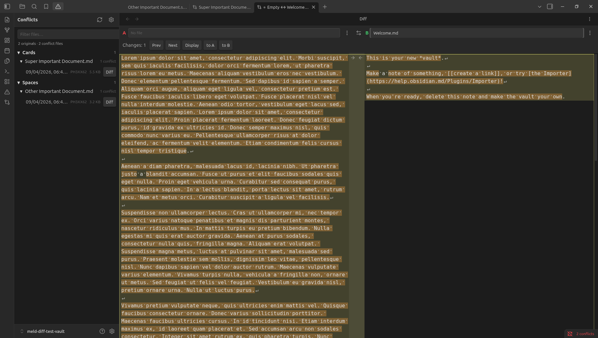
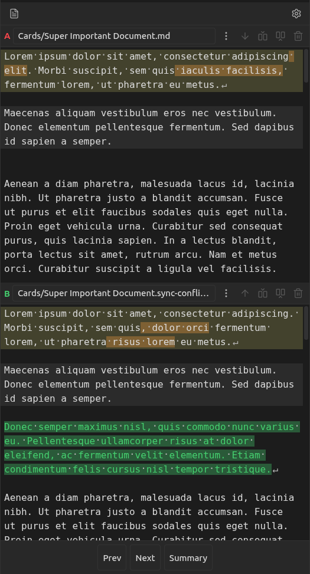

# Meld Diff

A two-pane diff inside Obsidian, the way Meld works on the desktop. Compare any two notes, or paste text that is not a note yet. It also finds sync-conflict files and pairs them with the original.

If you already use Meld, the gestures are the same. Click an arrow to take that hunk. Shift-click deletes it. Hold Ctrl (Cmd on macOS) to insert above or below, only when both sides have text there.

## This is for you if

- Syncthing, Nextcloud, Dropbox, or Obsidian Sync left a note.sync-conflict-… file next to a note and you want to merge it by hand.
- You want to compare two notes in the vault without leaving Obsidian.
- You want to paste a block from somewhere else, diff it against a note, and save the result as a new note.

This is not a git client. It does not talk to Syncthing. It does not diff images, PDFs, or canvases.

## Conflicts

Conflict view lists originals and the conflict files next to them. Open a row and the pair loads in the diff. Syncthing names are recognized by default. Other tools can be added with a glob or a regex in settings.

If the original is not in the same folder, the diff still opens and offers to find a note with that name. It will not load one from another folder unless you confirm.

## The diff

Both panes are source editors. Markdown stays raw, so [[links]], list markers, and punctuation are part of the diff.

- Text only on A is red. Text only on B is green. A change on both sides is yellow, with the differing words marked.
- The file bar shows the folder and the name (folder/note.md). The long .sync-conflict-… tail is what gets cut off.
- **Original on A** puts the original on the left. On a phone, A is the top pane. Turn the setting off and the original opens on B.
- Autosave is on for a side that is already a note. A side with no file says **No file** until you use Save as and pick a folder and a name.

## Phone

The same diff, stacked. Conflict view is in the left drawer, with Files and Search. The cursor picks the hunk. The buttons on the file bar replace, insert above, insert below, or delete it.

## Colors

Hunk colors follow the theme: red, green, yellow, orange. They do not follow the accent color. Settings and Style Settings can override them.

## License

MIT
